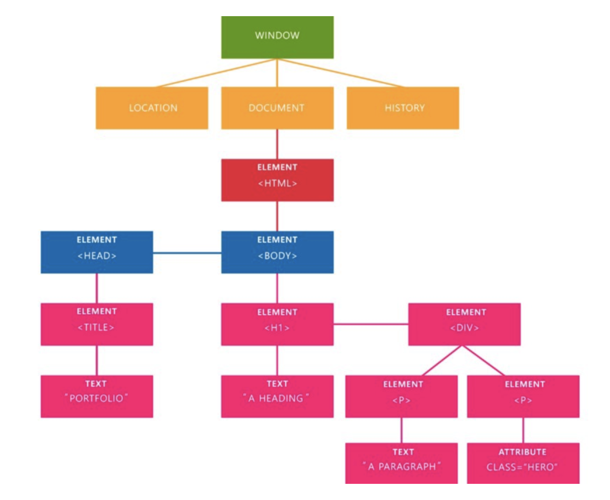

# Lesson Plan JavaScript2 Week 1

## Agenda

The purpose of this class is to introduce to the student:

- How a webpage is made up of objects (DOM)
- How JavaScript can be used to manipulate those objects (DOM manipulation)
- Commonly used browser defined functions and properties

## Core concepts

FIRST HALF (12.00 - 13.30)

> Is this your first lecture for this class?
> Please introduce yourself briefly:
>
> - Job
> - Education
> - City
> - Why you love programming (if you do)

## 1. Document Object Model (DOM)

### Explanation

The [Document Object Model (DOM)](https://developer.mozilla.org/en-US/docs/Web/API/Document_Object_Model/Introduction) is an _object-oriented representation_ of a web page (HTML document). Every HTML element (ex. `h1`, `p` or `img`) is corrected first and then converted into a JavaScript object by the browser, making it possible for us to use JavaScript to change the contents. Using JavaScript code we can access the `DOM` through a global object called `document` or `window.document`.

### Example

> Show the student the following HTML in the browser, and then refer to it in the browser console.

```html
<!DOCTYPE html>
<html>
  <head>
    <title>My title</title>
  </head>

  <body>
    <h1>My header</h1>
    <p>This is a nice paragraph</p>
    <ul>
      <li>Item 1</li>
      <li>Item 2</li>
    </ul>
    <a href="https://www.w3schools.com/js/pic_htmltree.gif">My link</a>
  </body>
</html>
```



Notice how the DOM is structured in a tree-like manner. It goes from top (highest) to bottom (lowest) level. It's very much like a family tree: the highest level is the great-great-great-grandparent, while the lowest level is the grand-grand-grand-child.

### Exercise

1. Create an HTML file including the structure of a basic webpage (including `!DOCTYPE`, `html`, `head` and `body`, 1 `h1` and 1 `p`)
2. Find out how to target the `head`, `body` and `h1` elements using the browser console
3. Present your solution and how you figured it out (_Teacher chooses two people_)

### Essence

**The DOM is created by the browser: it reads your HTML file and transforms the elements into objects. We use JavaScript to select these elements in order to change them.**

## 2. Commonly used browser defined functions and properties

### Explanation

As developers we can use code others have written. The browser contains predefined functions that we can use in order to get certain things done. For example, we can add/update/remove new HTML elements to the DOM. The browser also offers us properties, so that we can also play with the user's viewing experience. For example, we can modify the browser's width programmatically so we can offer a responsive website.

### Example

1. Finding DOM elements in HTML page
    - `document.getElementById(id)` - Find an element by element id
    - `document.getElementsByTagName(name)` - Find elements by tag name
    - `document.getElementsByClassName(name)` - Find elements by class name
    - `document.querySelector(selector)` - Find a single element that matches a css-like selector
    - `document.querySelectorAll(selector)` - Find all elements  that matche a css-like selector

2. Adding and Deleting elements in HTML page
    - `document.createElement(element)` - Create a new HTML element
    - `document.removeChild(element)` - Remove an HTML element
    - `document.appendChild(element)` - Add an HTML element
    
3. Changing existing HTML elements
    - `element.innerHTML` - Change the content/layout of the element
    - `element.innerText` - Change just the text of the element
    - `element.setAttribute(attribute, value)` - Set/Change attribute of an element

* Note: `getElementsByTagName` and `getElementsByClassName` returns a list of all matched elements. However, this is not the usual JavaScript array but an HTMLCollection List. A detailed list of APIs available on the DOM can be found [here](https://developer.mozilla.org/en-US/docs/Web/API/Document).

### Exercise

**Exercise Option 1**

1. Create an HTML form element
2. Create an HTML input(type text) element and set its placeholder as "Name"
3. Add both these elements to the form element
4. Create a button element and add these properties to it:

**Exercise Option 2**

Find browser functions or properties to show how we can...

1. Display an alert box?
2. Find out what the browser's name is?
3. Go back one page?
4. Add button element to the form
5. Add the form element to the body element

**Exercise Option 2**
Given the following HTML
```
<!DOCTYPE html>
<html lang="en">
<head>
    <meta charset="UTF-8">
    <title>Document</title>
</head>
<body>
    <div class="header">
    </div>
    <section id="container" class="main-section extra">
        <ul>
            <li class="first">one</li>
            <li class="second">two</li>
            <li class="third">three</li>
        </ul>
        <ol>
            <li class="first">one</li>
            <li class="second">two</li>
            <li class="third">three</li>
        </ol>
    </section>
    <div class="footer">
    </div>
</body>
</html>
```
Write the code necessary to do the following:

1. Select the section with an id of container using querySelector.  
2. Select all of the list items with a class of "second".  
3. Select a list item with a class of third, but only the list item inside of the ol tag.  
4. Give the section with an id of container the text "Hello!".  
5. Add the class main to the div with a class of footer.  
6. Remove the class extra on the div  with id container.  
7. Create a new li element.  
8. Give the li the text "four".  
9. Append the li to the ul element.  
10. Loop over all of the lis inside the ol tag and give them a background color of "green".  
11. Remove the div with a class of footer.  

### Essence

**We can use by the browser predefined functions and properties to shape the user's experience of our application.**

SECOND HALF (14.00 - 16.00)

## 3. Event listeners

### Explanation

Give analogy.

### Example
Start with the following javascript:

```
let h1 = document.createElement('h1');
h1.innerText = 'Oscar nominations';
let form = document.createElement('form');
let name = document.createElement('input');
nameTxt.setAttribute('type','text');
nameTxt.setAttribute('value','movie name');
let btn = document.createElement('input');
btn.setAttribute("type","button");
btn.setAttribute('value','Click Me');
form.appendChild(nameTxt);
form.appendChild(btn);
let ol = document.createElement('ol');
let mainDiv = document.createElement('div');
mainDiv.appendChild(h1);
mainDiv.appendChild(form);
mainDiv.appendChild(ol);
document.body.appendChild(mainDiv);
```

Briefly explain what the javascript does.
Add an event listener to button that creates and appends the name to the list.

```
btn.addEventListener('click', () => {
  let li = document.createElement('li');
  list.innerText = nameTxt.value;
  ol.appendChild(li);
});
```

Demonstrate what it does. Show where to see event listeners in developer tools.


### Exercise

Students should add a button for each `li` that can be used to remove that name from the list.

The goal is for students to learn about the click event handler arguments.

## 4. DOM manipulation

### Explanation

`DOM manipulation` refers to the act of using JavaScript to select and modify elements within the DOM. We do this in order to provide users interactivity with the page: for example, if a button is clicked the background color changes, or if a menu item is hovered over it becomes bigger.

### Example

```html
<!DOCTYPE html>
<html>
  <head>
    <title>My title</title>
  </head>

  <body>
    <h1>My header</h1>
    <p>This is a nice paragraph</p>
    <ul>
      <li>Item 1</li>
      <li>Item 2</li>
    </ul>
    <button>My button</button>
    <a href="https://www.w3schools.com/js/pic_htmltree.gif">My link</a>
  </body>
</html>
```

```js
// 1. Make body background color red
const body = document.body;
body.style.background = 'red';

// 2. Change paragraph content
const p = document.querySelector('p');
p.innerHtml = 'This paragraph has changed!';

// 3. Create and add a new element to an existing HTML element
const thirdLi = document.createElement('li');
const ul = document.querySelector('ul');
ul.appendChild(thirdLi);

// 4. On button click alert the user!
const button = document.querySelector('button');
button.addEventListener('click', function() {
  alert('You clicked the button!');
});
```

### Exercise

Write JavaScript code that...

1. changes the `href` value to `https://www.hackyourfuture.net/`
2. changes the `button` text to `Make background colored!`
3. colors the `body` background to your favorite color, when the button is clicked

Present your solution and how you figured it out (_Teacher chooses two people_)

### Essence

**Using JavaScript we can select and modify DOM elements. In this way we can provide the user useful interactions with the webpages they're engaged in.**
