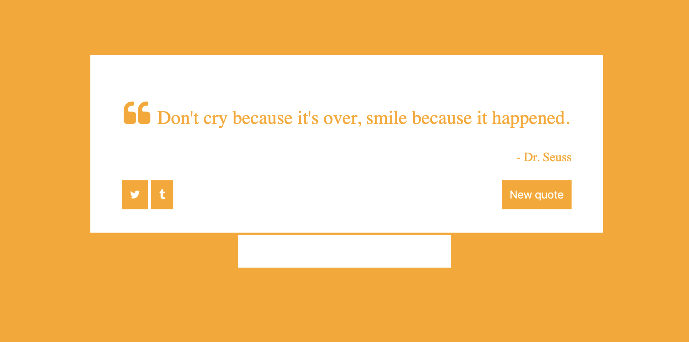

# Homework JavaScript2 Week 1

## **Todo list**

1. Practice the concepts
2. JavaScript exercises
3. Code along
4. PROJECT: Random Quote Generator

## **1. Practice the concepts**

Before we head into the exercises, it might be nice to do some interactive exercises first! In the following resource you'll find some exercises that'll teach you the basics of the interaction between JavaScript and the DOM:

- [Making webpages interactive](https://www.khanacademy.org/computing/computer-programming/html-css-js)

## **2. JavaScript exercises**

> Inside of your `JavaScript2` fork, find the folder called `Week1`. Inside of that folder, find the folder called `js-exercises`. In this folder you will find five `.js` files (sometimes with a matching `.html` file), one for each exercise where you need to write your code. Please use the correct file for the respective exercise.

**Exercise 1: The book list**

I'd like to display my three favorite books inside a nice webpage!

```js
const books = [
  {
    title: 'The Design of Everyday Things',
    author: 'Don Norman',
    alreadyRead: false
  },
  {
    title: 'The Most Human Human',
    author: 'Brian Christian',
    alreadyRead: true
  },
  {
    title: 'The Pragmatic Programmer',
    author: 'Andrew Hunt',
    alreadyRead: true
  }
];
```

1. Iterate through the array of books.
2. For each book, create a `<p>` element with the book title and author and append it to the page.
3. Use a `<ul>` and `<li>` to display the books.
4. Add an `` to each book that links to a URL of the book cover.
5. Change the style of the book depending on whether you have read it (green) or not (red).

The end result should look something like this:
https://hyf-js2-week1-makeme-ex1-demo.herokuapp.com/

**Exercise 2: About me**

Given this HTML:

```html
<!DOCTYPE html>
<html>
  <head>
    <meta charset="utf-8" />
    <title>About Me</title>
  </head>
  <body>
    <h1>About Me</h1>

    <ul>
      <li>Nickname: <span id="nickname"></span></li>
      <li>Favorite food: <span id="fav-food"></span></li>
      <li>Hometown: <span id="hometown"></span></li>
    </ul>
  </body>
</html>
```

1. Add a script tag to the bottom of the HTML body.
2. (In the JavaScript) Change the body tag's style so it has a font-family of "Arial, sans-serif".
3. (In the JavaScript) Replace each of the spans (nickname, fav-food, hometown) with your own information.
4. Iterate through each li and change the class to "list-item".
5. (In the HTML head) Add a style tag that sets a rule for .list-item to make the color red.
6. Create a new img element and set its src attribute to a picture of you. Append that element to the page.

**Exercise 3: The logo hijack**

No homepage is safe from the logo bandit! Everytime he sees a Google Logo he replaces it with a logo from HackYourfuture instead: https://www.hackyourfuture.dk/static/logo-dark.svg.

In this exercise you're expected to write a JavaScript function that can be executed in the console of the [Google website](https://www.google.com).

1. Find out how to select the element that contains the Google logo, and store it in a variable
2. Modify the source and sourceset of the logo so that it's replaced by the HackYourFuture logo instead

**Exercise 4: What's the time?**

Why wear a watch when you can check the time, live in your webpage?

1. Create a basic HTML file
2. Include a script tag and link the JavaScript file
3. Inside the JS file, write a function that adds the current time to the webpage. Make sure it's written in the HH:MM:SS notation (hour, minute, second). Hint: use `setInterval()` to make sure the time stays current
4. Have the function execute when it's loading in the browser

**Exercise 5: The cat walk**

Start with this webpage, which has a single img tag of an animated GIF of a cat walking.

```html
<!DOCTYPE html>
<html>
  <head>
    <meta charset="utf-8" />
    <title>Cat Walk</title>
  </head>
  <body>
    
  </body>
</html>
```

1. Create a variable to store a reference to the img.
2. Change the style of the img to have a "left" of "0px", so that it starts at the left hand of the screens.
3. Create a function called catWalk() that moves the cat 10 pixels to the right of where it started, by changing the "left" style property.
4. Call that function every 50 milliseconds. Your cat should now be moving across the screen from left to right. Hurrah!
5. When the cat reaches the right-hand of the screen, restart them at the left hand side ("0px"). So they should keep walking from left to right across the screen, forever and ever.
6. When the cat reaches the middle of the screen, replace the img with an image of a cat dancing (use this URL: https://tenor.com/StFI.gif), keep it dancing for 5 seconds, and then replace the img with the original image and have it continue the walk.


The end result should look and behave similar to [https://dancingcat-sandbox.mxapps.io](https://dancingcat-sandbox.mxapps.io)

## **3. Code along**

In the following tutorial you'll learn how to make a small web application that allows a user to add new issues to a board. Included is practice with [Bootstrap](https://getbootstrap.com/).

Enjoy!

- [Build an Issue Tracker](https://www.youtube.com/watch?v=NYq9J-Eur9U)

## **4. PROJECT: Random Quote Generator**

> Every week ends with a project you have to build on your own. Instead of getting clear-cut instructions, you'll get a list of criteria that your project needs to measure up to.

> Write the project code in the folder `Week1 \ project`.

In this week's project you'll be making a Random Quote Generator! It includes a text box and a simple button that, when clicked, take a random quote out of a set amount of quotes and show it in the page. Here's how it should look:



Here are the requirements:

- Include at least 1 JavaScript, CSS and HTML file
- The design should look similar to the one in the picture above
- No CSS frameworks allowed
- Each time the button is clicked it should show a random quote
- Create a function that fires after the button click
- Collect 6 of your favorite quotes (quote and author) and store them in the right data structure

Good luck!

## **SUBMIT YOUR HOMEWORK!**

After you've finished your todo list it's time to show us what you got! Upload all your files to a forked repository (a copy from the original, which in this case is the [JavaScript2](https://www.github.com/HackYourFuture/JavaScript2) repository) using GIT. Then make a pull request to the original.

If you need a refresher, take a look at the following [guide](../hand-in-homework-guide.md) to see how it's done.

The homework that needs to be submitted is the following:

1. JavaScript exercises
2. Project: Random Quote Generator

_Deadline Saturday 23.59 CET_
