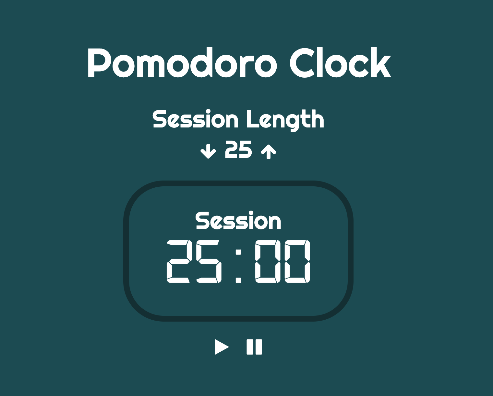

# Homework JavaScript2 Week 2

## **Todo list**

1. Practice the concepts
2. JavaScript exercises
3. Code along
4. PROJECT: The Pomodoro Clock

## **1. Practice the concepts**

Before we head into the exercises, it might be nice to do some interactive exercises first! In the following resource you'll find some exercises that'll teach you all about callbacks and array functions!

- [Learn JavaScript: Iterators](https://www.codecademy.com/learn/introduction-to-javascript/modules/learn-javascript-iterators)

## **2. JavaScript exercises**

> Inside of your `JavaScript2` fork, find the folder called `Week2`. Inside of that folder, find the folder called `js-exercises`. In this folder you will find five `.js` files, one for each exercise where you need to write your code. Please use the correct file for the respective exercise.

**Exercise 1: The odd ones out**

Look at the following code snippet:

```js
function doubleEvenNumbers(numbers) {
  const newNumbers = [];
  for (let i = 0; i < numbers.length; i++) {
    if (numbers[i] % 2 === 0) {
      newNumbers.push(numbers[i] * 2);
    }
  }
  return newNumbers;
}

const myNumbers = [1, 2, 3, 4];
console.log(doubleEvenNumbers(myNumbers)); // Logs "[4, 8]" to the console
```

The `doubleEvenNumbers` function returns only the even numbers in the array `myNumbers` and doubles them. Like you've learned in the [README](README.md), this block of code isn't easy to decipher.

Let's rewrite it.

- Using the `map` and `filter` functions, rewrite the `doubleEvenNumbers` function.

**Exercise 2: What's your Monday worth?**

When you're a developer at a big company your Monday could look something like this:

```js
const mondayTasks = [
  {
    name: 'Daily standup',
    duration: 30, // specified in minutes
  },
  {
    name: 'Feature discussion',
    duration: 120,
  },
  {
    name: 'Development time',
    duration: 240,
  },
  {
    name: 'Talk to different members from the product team',
    duration: 60,
  },
];
```

Let's assume your hourly rate is €25. How much would you earn on that day?

- Write a program that finds out what your hourly rate on a Monday would be
- Use the `map` array function to take out the duration time for each task.
- Multiply each duration by a per-hour rate for billing and sum it all up.
- Output a formatted Euro amount, rounded to Euro cents, e.g: `€11.34`.
- Make sure the program can be used on any array of objects that contain a `duration` property with a number value

**Exercise 3: Lemon allergy**

Your mom bought you a basket of fruit, because you're doing so well in HackYourFuture. How sweet of her!

```js
const fruitBasket = ['Apple', 'Lemon', 'Grapefruit', 'Lemon', 'Banana', 'Watermelon', 'Lemon'];
```

However, she forgot that you are allergic to lemons! Let's quickly dispose of them before you get an attack.

- Write a function
- Use the `filter` array function to take out the lemons
- Output a string that says: "My mom bought me a fruit basket, containing [array of fruits] !"

**Exercise 4: Collective age**

Have you ever wondered how old the HackYourFuture team members are? Or better yet: what the collective age is? Let's find out!

```js
const hackYourFutureMembers = [
  { name: 'Wouter', age: 33 },
  { name: 'Federico', age: 32 },
  { name: 'Noer', age: 27 },
  { name: 'Tjebbe', age: 22 },
];
```

- Write a program that calculates the combined age of every member
- Make use of the `map` function to get the ages
- It should contain a function that takes a callback
- The callback adds all the ages together and returns the number
- The main function should log the string "The collective age of the HYF team is: [number]" to the console, and afterwards return the number

**Exercise 5: My favorite hobbies**

I've got a couple of hobbies that I want to showcase in a webpage.

```js
const myHobbies = [
  'Meditation',
  'Reading',
  'Programming',
  'Hanging out with friends',
  'Going to the gym',
];
```

- Write a program that outputs each of these inside an HTML file
- Create an HTML and JavaScript file, link them together
- Use the `map` and/or `forEach` function to put each hobby into a list item
- Output the list items in an unordered list

## **3. Code along**

Programming can be used to not only make websites, but also games! In the following tutorial you're going to apply your DOM manipulation skills in order to make a classic game: Rock, Paper, Scissors! Enjoy!

- [Build a Rock, Paper, Scissors Game](https://www.youtube.com/watch?v=WR_pWXJZiRY)

## **4. PROJECT: The Pomodoro Clock**

> Every week ends with a project you have to build on your own. Instead of getting clear-cut instructions, you'll get a list of criteria that your project needs to measure up to.

> Write the project code in the folder `Week2 \ project`.

In this week's project you'll be making a Pomodoro Clock! A user can specify how many minutes the timer should be set, and with a click on the play button it starts counting down! If the user wants to pause the timer, they can do so by clicking the pause button.

It should look like this:



Here are the requirements:

- If the timer is running, the user can't change the session length anymore
- Use at least 3 functions
- Display minutes and seconds
- If the timer finishes the timer should be replaced by the message: `Time's up!`

If you are having trouble understanding the functionality check this [demo](https://pomodoroclock-sandbox.mxapps.io).

Good luck!

## **SUBMIT YOUR HOMEWORK!**

After you've finished your todo list it's time to show us what you got! The homework that needs to be submitted is the following:

1. JavaScript exercises
2. PROJECT: The Pomodoro Clock

Upload both to your forked JavaScript2 repository in GitHub. Make a pull request to the original repository.

> Forgotten how to upload your homework? Go through the [guide](../hand-in-homework-guide.md) to learn how to do this again.

_Deadline Saturday 23.59 CET_
