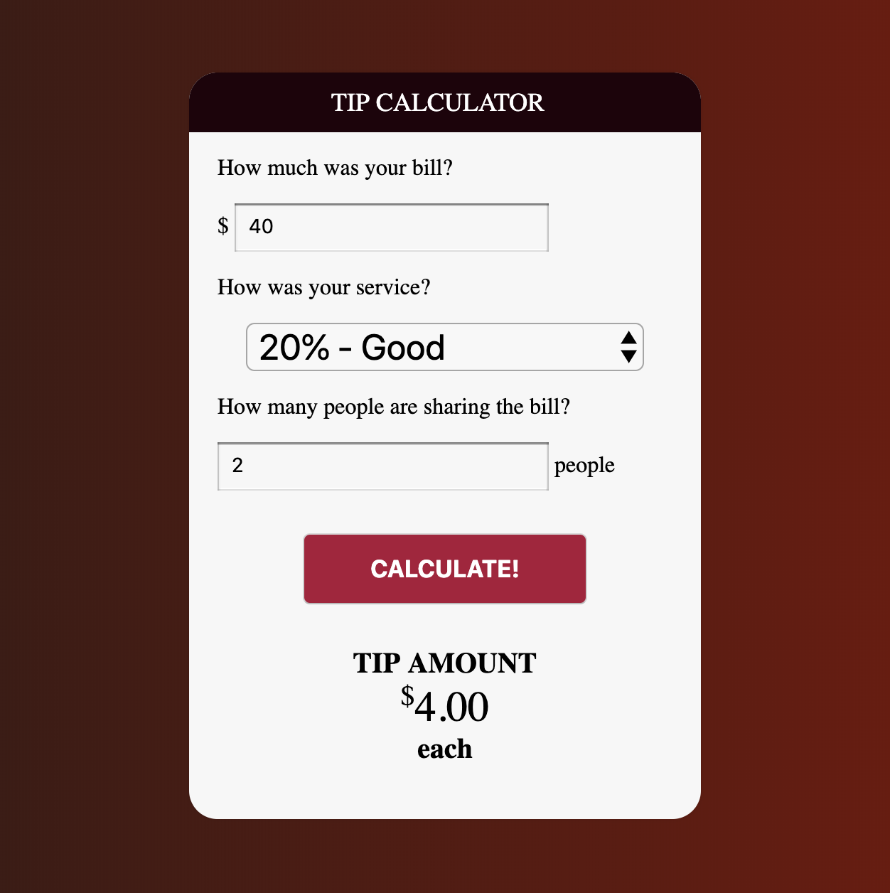
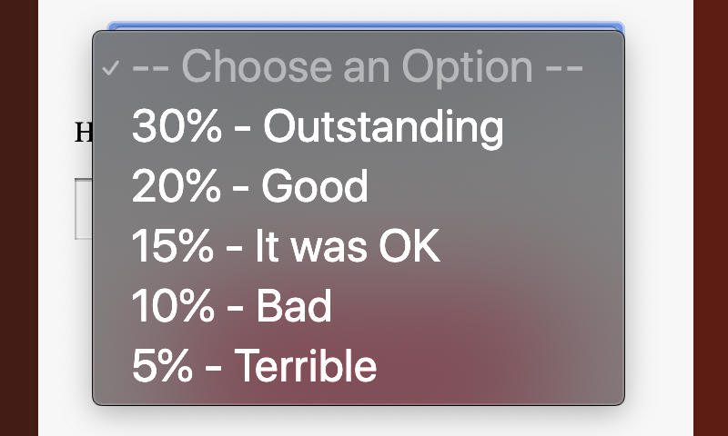

# Homework JavaScript2 Week 3

## **Todo list**

1. Practice the concepts
2. JavaScript exercises
3. Code along
4. PROJECT: The Tip Calculator

## **1. Practice the concepts**

Let's get familiar with basic Javascript concepts, with interactive exercises! Check out the following resources:

- [Introduction to JavaScript: Scope](https://www.codecademy.com/courses/introduction-to-javascript/lessons/scope/exercises/scope)

## **2. JavaScript exercises**

> Inside of your `JavaScript2` fork, create a folder called `week3`. Inside of that folder, create a folder called `js-exercises`. For all the following exercises create a new `.js` file in that folder (5 files in total). Make sure the name of each file reflects its content: for example, the filename for exercise one could be `addSix.js`.

**Exercise 1: Add six**

Declare a function called `createBase`. It should return a closure, that adds a number to the base number argument.

Call the function three times. The return values should be:

1. 15
2. 24
3. 36

It should look a little like this:

```js
function createBase() {
  // Put here your logic...
}

const addSix = createBase(6);

// Put here your function calls...
addSix();
```

**Exercise 2: Take out the duplicates**

Write a function called `removeDuplicates`, that takes in an array as an argument:

```js
const letters = ['a', 'b', 'c', 'd', 'a', 'e', 'f', 'c', 'b'];
```

The function should remove duplicate letters. So the result should be:

```js
letters === ['a', 'b', 'c', 'd', 'e', 'f'];
```

**Exercise 3: Guess the output**

In this exercise you'll be presented with 2 code snippets. Your task is to guess the output and write out your reasoning, for each single one, in 50 words or less.

```js
let a = 10;
const x = (function() {
  a = 12;
  return function() {
    alert(a);
  };
})();

x();
```

```js
const x = 9;
function f1(val) {
  val = val + 1;
  return val;
}
f1(x);
console.log(x);

const y = { x: 9 };
function f2(val) {
  val.x = val.x + 1;
  return val;
}
f2(y);
console.log(y);
```

**Exercise 4: Make the sandwich**

Mrs Potts the school dinner lady is tired of all the global sandwich variables getting under her feet and tripping her up all the time. She needs help cleaning her kitchen. Will you help her?

She would like it very much if you would build a sandwich machine for her, but wrap it in a closure so as to keep everything neat.

1. Create a self executing function
2. Within the closure, create three little functions to add the bread, spread the butter and add the jam. These little methods should use console.log to write a string representing their action to the DOM, e.g. "Now spreading the jam!"
3. Assign makeSandwich to the global window object, thus smuggling it out of the closure.
4. Call makeSandwich from outside the closure

It should log to the console the following message:

```markdown
Adding bread
Now spreading the butter
Spreading jam
```

**Exercise 5: The lottery machine**

Don't you just love the thrill of the lottery? What if I told you we can make our own lottery machine? Let's get started!

Write a function that takes 4 arguments.

- A start value
- An end value
- A callback that executes if the number is divisible by 3
- A callback that executes if the number is divisible by 5

The function should first generate an array containing values from start value to end value (inclusive).

Then the function should take the newly created array and iterate over it, and calling the first callback if the array value is divisible by 3.

The function should call the second callback if the array value is divisible by 5.

Both functions should be called if the array value is divisible by both 3 and 5.

```js
function threeFive(startIndex, stopIndex, threeCallback, fiveCallback) {
  const numbers = [];
  // make array
  // start at beginning of array and check if you should call threeCallback or fiveCallback or go on to next
}

threeFive(10, 15, sayThree, sayFive);

// Should create an array [10,11,12,13,14,15]
// and call sayFive, sayThree, sayThree, sayFive
```

## **3. Code along**

In the following "code along" you'll be making a Booklist App. A user will be able to add books to a list by filling in a form, and also delete each book entry in the list.

You'll make the app using vanilla JavaScript and CSS framework [Bootstrap](https://www.getbootstrap.com).

Happy learning!

- [Build a Booklist App](https://www.youtube.com/watch?v=JaMCxVWtW58)

## **4. PROJECT: The Tip Calculator**

> Every week ends with a project you have to build on your own. Instead of getting clear-cut instructions, you'll get a list of criteria that your project needs to measure up to.

> Before you start, create a new folder called `project` that includes the files for the following app you'll be building.

In this week's project you'll be making a Tip Calculator! A user can fill in 3 things:

1. The amount of the bill
2. How good the service was
3. How many people will share the bill

When the button is clicked a calculation is made and the user can read the tip amount underneath.

It should look like this:



Here are the requirements:

- No frameworks allowed
- Use a form, that has 3 input fields (the first and last can only take numbers)
- The second field should have the following options:



- If there's only 1 person who shares the bill, output only the tip amount (omit the "each")
- If any of the input fields are empty when the button is clicked, call an alert that says: "You need to fill in all the fields!"

Good luck!

## **SUBMIT YOUR HOMEWORK!**

Finished? Good on you! The homework that needs to be submitted is the following:

1. JavaScript exercises
2. PROJECT: The Tip Calculator

Upload both to your forked JavaScript2 repository in GitHub. Make a pull request to the original repository.

> Forgotten how to upload your homework? Go through the [guide](../hand-in-homework-guide.md) to learn how to do this again.

_Deadline Saturday 23.59 CET_
