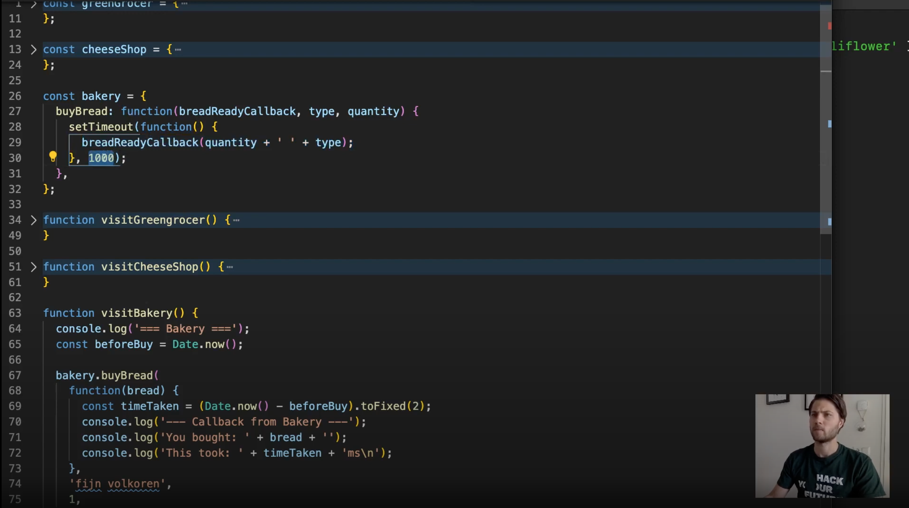

# Reading Material JavaScript2 Week 3

## Agenda

These are the topics for week 3:

1. Scope
   - Global vs. local (function and block)
   - Const and let
2. Hoisting
   - When does hoisting happen?
3. Closures
   - Execution context
   - Why do we need closures?
4. Thinking like a programmer II

## 0. Video Lectures

Your teacher Wilgert has made video lectures for this week's material. You can find them here: [Videos 22 - 30](https://www.youtube.com/playlist?list=PLVYDhqbgYpYU-7_oyPBkUuuis5bL1Dk8n)

<a href="https://www.youtube.com/playlist?list=PLVYDhqbgYpYU-7_oyPBkUuuis5bL1Dk8n" target="_blank"></a>

## 1. Scope

One of the central concepts in programming is the idea of `context`: the meaning of any particular thing is only determined in relation to its direct surroundings. Let's take language for example. If I say the following sentence:

> I never said she stole my money.

Reading this it's not obvious how to interpret what the situation is about. Depending on the emphasis of the words it could mean any of the following:

- _I_ never said she stole my money.
- I _never_ said she stole my money.
- I never _said_ she stole my money.
- I never said _she_ stole my money.
- I never said she _stole_ my money.
- I never said she stole _my_ money.
- I never said she stole my _money_.

It depends on `context` for me to know what really happened.

Let's draw the line to programming. Simply put, just like context gives meaning to a word, `scope` gives meaning to a variable/object.

That meaning is defined by whether or not the variable is accessible. If the variable is not within the "scope" of any given code block, it can't access it. Which means it doesn't exist from the perspective of that code block.

This is actually a good thing: we want to make sure that parts of our data have limited accessibility. Imagine that the password to your email account would be available everywhere, and you could easily get access to it by writing some code in the console of your browser. Do you know how easily it would be to hack into your account?

For further research, check out the following:

- [Variable Scope & Context](https://www.youtube.com/watch?v=WPcW83BMT3Y)

### Global vs. local (function and block)

Scope can be divided into two basic types: global and local scope. In any given application, there is one global scope. But there can be many local scopes. Any variable declared outside of a function belongs to the global scope and is therefore accessible from anywhere in the code. Variables declared within a local scope are only accessible within that scope.

Local scope can be further divided into two categories: function and block. Let's look at **function scope** first.

A unique local scope gets created whenever a function is declared. The variables declared within will only be accessible within that scope, nowhere else. This makes it possible to declare variables within the same name in each different local scope. This also means that it's not possible to refer to a variable declared in one local scope, within another local scope.

```js
function createLocalScope() {
  const localVariable = 'this variable can only be accessed within this function';
  console.log(localVariable);

  const localOnlyHere = 'This variable can only be accessed here, nowhere else';
}

function createAnotherLocalScope() {
  const localVariable =
    "Even though this variable has the same name, it has nothing to do with the other localVariable, because it doesn't exist outside of that function";
  console.log(localVariable);
  console.log(localOnlyHere);
}

createLocalScope();
createAnotherLocalScope();
```

However, variables declared within the global scope can be accessed anywhere! Actually, that's the very purpose of global scope. In the context of functions this means that you don't have to pass it as an argument, but that you can directly refer to it within the function.

```js
const globalVariable = 'This variable can be accessed wherever in the code';

function accessGlobalVariable() {
  console.log(globalVariable);
}
console.log(globalVariable);
accessGlobalVariable();
```

The second type of local scope is called **block scope**. A block, generally speaking, is any code wrapped within `{ }`. This includes conditional statements (`if` and `switch`) and loops (`for`, `while` and `do/while`).

Go through the following resources to learn more about `scope`:

- [JavaScript: Introduction to Scope (function scope, block scope)](https://dev.to/sandy8111112004/javascript-introduction-to-scope-function-scope-block-scope-d11)
- [Understanding Scope in JavaScript](https://www.youtube.com/watch?v=SBjf9-WpLac)
- [Everything you wanted to know about JavaScript scope](https://ultimatecourses.com/blog/everything-you-wanted-to-know-about-javascript-scope)

### Const and let

As mentioned in the previous module, we prefer to declare variables using `const` and `let`. This is because the keywords are more descriptive and restrictive. This makes them easier to work with.

In relation to scope both also behave differently: they are block scoped. This means that they can be accessed from outside a `{ }`.

Go through the following resources to learn more about this:

- [How let and const are scoped in JavaScript](https://wesbos.com/javascript-scoping/)
- [Should you truly never use var?](https://dev.to/johnwolfe820/should-you-never-truly-use-var-bdi)

## 2. Hoisting

If you look up the term "hoisting" in any dictionary, you'll find something like this:

> "To raise [something] by means of ropes and pulleys"

A simple example of hoisting is the hoisting of a flag on a pole. You pull on the rope and slowly but surely the flag gets raised up.

In JavaScript, hoisting refers to the mechanism of the browser's JavaScript compiler to bring every function and variable declaration to the top of their `scope`, before it starts executing anything. This can be either global or local scope, depending on where it is defined.

However, this does NOT mean that the actual value given to the variable or function will also be hoisted. It's just the declaration: that there are variables/functions that exist with that name.

### When does hoisting happen?

Hoisting happens during `compile-time`.

When you execute your JavaScript code, the interpreter goes through the code twice. The first time is called the `compile-time`, which is when your code is made ready to be executed: there will be safety checks, small optimizations and making sure the syntax is written correctly.

The second time is called `run-time`, which is where it actually executes your code by going through it line by line, doing the assignments, calling the functions, etc.

For more research, check out the following:

- [What is Hoisting in JavaScript?](https://medium.com/javascript-in-plain-english/https-medium-com-javascript-in-plain-english-what-is-hoisting-in-javascript-a63c1b2267a1)

## 3. Closures

Simply put, a closure is a function that is defined inside another function. This special function has access to the outer scope (and thus its variables), the scope that's created by the function that contains the closure function.

That's nice and all, but in order to really understand what it is and why we need it we need to take a look at another concept.

### Execution context

The execution context roughly equates to the 'environment' a function executes in. This consists of the following:

- The variable scopes
- Function arguments
- The value of the `this` object (more on that in JavaScript3)

Checkout the following to learn more about why this is important:

- [What is the Execution Context & Stack in JavaScript?](http://davidshariff.com/blog/what-is-the-execution-context-in-javascript/)

### Why do we need closures?

Closures are commonly used to give objects data privacy. We don't want certain data to be available globally. Think of it as "keeping something a secret. Take, for example, the following situation:

> You want to log in to your email account, so you need a password. Usually you have that password in your head, or somewhere written down in a place that can only be accessed in a certain way. It's not out there in public, able to be accessed by anyone.

In this example your password is the data you want to keep locally scoped. Your act of logging in is the inner function. The outer function could be your act of being on the computer, where your password is stored in a file somewhere.

For further study please check the following resources:

- [The Ultimate Guide to Execution Contexts, Hoisting, Scoping and Closures in JavaScript](https://www.youtube.com/watch?v=Nt-qa_LlUH0)
- [Understanding Closures](https://www.youtube.com/watch?v=rBBwrBRoOOY)
- [Master the JavaScript interview: what is a closure](https://medium.com/javascript-scene/master-the-javascript-interview-what-is-a-closure-b2f0d2152b36)
- [I never understood JavaScript closures](https://medium.com/dailyjs/i-never-understood-javascript-closures-9663703368e8)

## 4. Thinking like a programmer II

Becoming a good developer doesn't mean being good at any particular programming language: as a matter of fact, the language doesn't matter much.

This is the secret behind being a good developer: if you understand the concept, structure and principles of what makes a software program work, it doesn't matter in what way (the syntax) it's written.

This is also the reason why most developers, once they've mastered the fundamentals, are able to pick up another language quite easily. It's not because they have good memory; it's because they can recognize the patterns within the language.

- [How To Think Like a Programmer](https://www.youtube.com/watch?v=azcrPFhaY9k)
- [Computer Language Fundamentals: Five Core Concepts](https://blog.upperlinecode.com/computer-language-fundamentals-five-core-concepts-1aa43e929f40)

## Finished?

Are you finished with going through the materials? High five! If you feel ready to get practical, click [here](./MAKEME.md).
